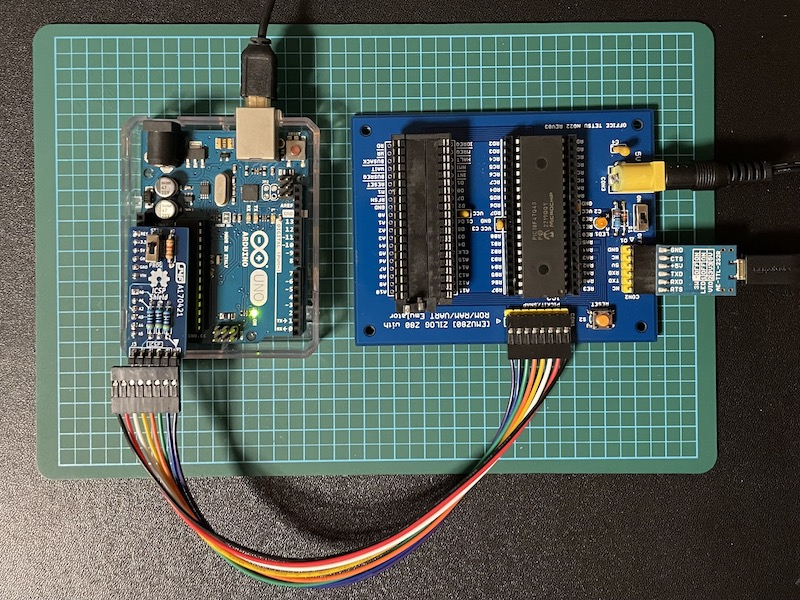
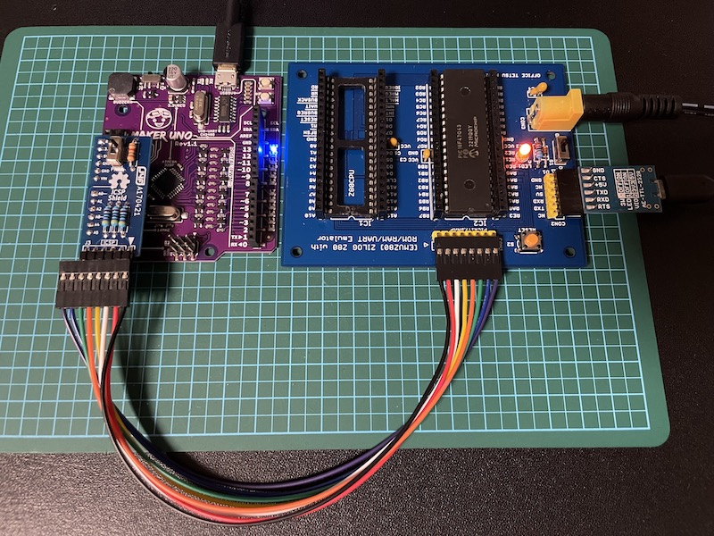
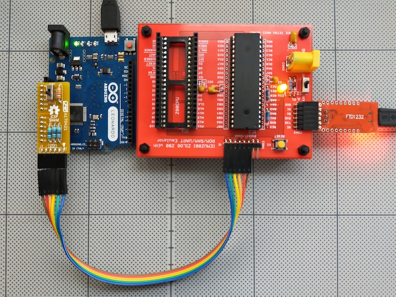

# Arduino-PIC-Programmer

Arduino UNOを使用したPIC書き込みシステムです。  
3種類のPICに書き込みできます。  
PIC18F47Q43  
PIC18F47Q83  
PIC18F47Q84  

  
Arduino UNO  

  
MAKER UNO

  
Arduino Leonardo

こちらのプログラムを改変して作成しました。  
FLASHING THE FIRMWARE WITH AN ARDUINO UNO AS PROGRAMMER  
https://hackaday.io/project/177988-68k-mbc-a-3-ics-68008-homebrew-computer/details

https://github.com/jaromir-sukuba/a-p-prog

## 部品
MAKER UNO - 秋月電子通商  
https://akizukidenshi.com/catalog/g/gM-16285/

ICSPシールド - オレンジピコショップ  
https://store.shopping.yahoo.co.jp/orangepicoshop/pico-a-055.html

基板用スライドスイッチSS-12D00-G3  
https://store.shopping.yahoo.co.jp/orangepicoshop/pico-x-030.html

8Pコネクター付きケーブル(20cm)  
https://store.shopping.yahoo.co.jp/orangepicoshop/PICO-X-122.html

抵抗  
R1-R3 470Ω  
R4 1k  

ピンヘッダー  

## ソフトウェア
pp.inoをArduino UNOに書き込んでください。  

pp3.cを各自の環境でコンパイルしてください。
```
gcc -Wall pp3.c -o pp3
```

実行ファイルpp3 (pp3.exe)とpp3_devices.datは同じ場所に置いて実行します。

PIC DEVICE IDを確認
```
./pp3 -c /dev/tty.usbserial-2220 -s 1700 -p -n -t 18f47q43
```

PICにHEXファイルを書き込み
```
./pp3 -c /dev/tty.usbserial-2220 -s 1700 -v 3 -t 18f47q43 emuz80_pic.hex
```

-c : Arduino UNOを指定  
-s : 待ち時間[ms]  
-v : 実行状態表示  
-t : ターゲット  

## 書き込み手順

1. EMUZ80の電源を切り、CPUを外す  
2. ArduinoとEMUZ80を接続。ICSPシールドのスライドスイッチをSTBY。Arduinoのリセットボタンを押してLED点滅を確認する  
3. EMUZ80の電源を入れる  
4. ICSPシールドのスライドスイッチをPROGにする  
5. Arduinoを接続しているコンピュータから書き込みコマンドpp3を実行する  
6. ArduinoのスライドスイッチをSTBYに戻し、RESETボタンを押すとArduinoのLEDが点滅を再開する  

## 資料
PIC18-Q43 Family Programming Specification - DS40002079E  
PIC18-Q83/84 Family Programming Specification - DS40002137D  
PIC18F2X/4XQ10 Memory Programming Specification - DS40001874H  
